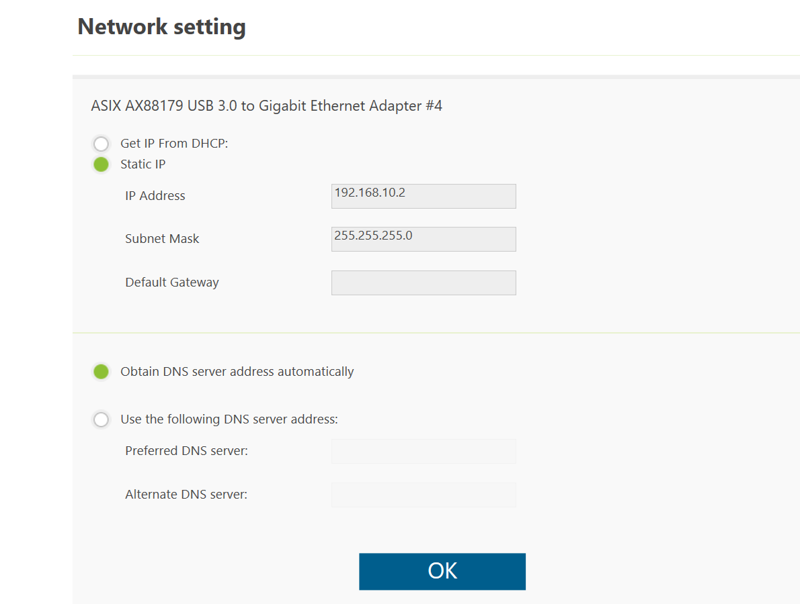
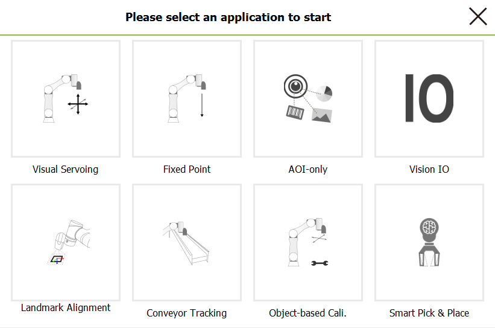
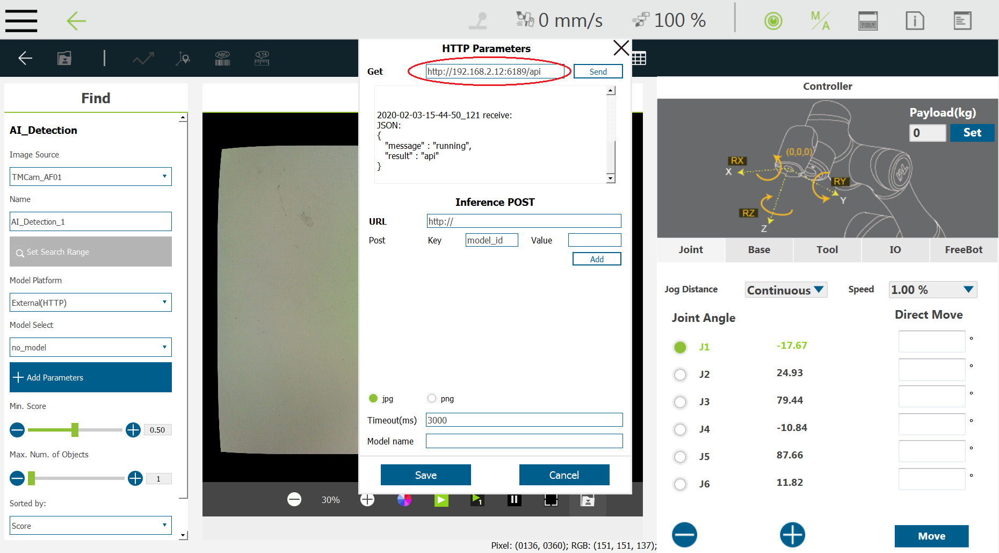

# __TM ROS Driver__

## __1. Overview__

The TM Robot is a state-of-the-art production tool that is highly compatible and flexible to collaboration between human and machine. The Robot Operating System (ROS) provides abundant libraries and tools which can be utilized to reduce the cost of trivial development software tool and build robot applications without struggling. Our TM ROS driver provides nodes for communication with Techman Robot controllers, data including robot states, images from the eye-in-hand camera and URDF models for various robot arms via _TMFlow_.

## __2. Feature__

### __ROS1 Driver__

The TM ROS driver connects to _TMFlow ethernet slave_ to control _TMFlow project_. Robot state is transmitted through this connection.  A working driver also connects to a _listen node_ (running at a _TMFlow project_) at the same time. To control the robot locomotion ,IO ,etc., the TM ROS driver sends robot script (_TM Robot Expression_) through this connection.
More information about _TM Robot Expression_ and _ethernet slave_, see [TMRobotExpression.pdf]  
The TM ROS driver for ROS1 is a __single ROS node__ which creates a ROS interface such as topics and services:

> __Action Server__
>
> - An  action interface on _/follow_joint_trajectory_ for seamless integration with MoveIt
>
> __Topic Publisher__
>
> - publishes feedback state on _/feedback_states_  
feedback state include robot position, error code, io state, etc.
(see _tm_msgs/msg/FeedbackState.msg_)  
> - publishes joint states on _/joint_states_  
> - publishes tool pose on _/tool_pose_
>
> __Service Server__
>
> - _/tm_driver/send_script_ (see _tm_msgs/srv/SendScript.srv_) :  
send robot script (_TM Robot Expression_) to _listen node_  
> - _/tm_driver/set_event_ (see _tm_msgs/srv/SetEvent.srv_) :  
send "Stop", "Pause" or "Resume" command to _listen node_  
> - _/tm_driver/set_io_ (see _tm_msgs/srv/SetIO.srv_) :  
send digital or analog output value to _listen node_  
> - _/tm_driver/set_position (see _tm_msgs/srv/SetPosition.srv_) :  
send motion command to _listen node_, the motion type include PTP, LINE, CIRC ans PLINE, the position value is joint angle(__J__) or tool pose(__T__), see [TMRobotExpression.pdf]
>
> __Usage__
>
> For example, execute the launch file to enable the driver to connect to tm5-900 robot  
>
> ```bash
> roslaunch tm_driver tm5_900_bringup.launch robot_ip:=YOUR_ROBOT_IP_ADDRESS
> ```
>

### __ROS2 Driver__

The driver for ROS2 publishes identical topics and provides identical services as ROS1 version, but for now there is no interface integration with MoveIt.  
This driver uses _ros2 composition_, there are two nodes in the identical process:
one node publishes topics while the other node sets up service servers.

> __Usage__
>
>For example, execute the launch script to enable the driver to connect to tm5-900 robot  
>
>```bash
>ros2 launch tm_driver tm5_900_bringup.py >robot_ip:=YOUR_ROBOT_IP_ADDRESS
>```
>
> __Techman robot vision__
>
> - type: sensor_msgs::msg::Image
> - message name: techman_image

### __Installation__

> __Building from source__
>
> 1. install ROS and dependency :  
__for ROS1 :__  
install ROS (melodic)  
install ros-melodic-moveit  
install ros-melodic-industrial-core  
__for ROS2 :__  
install ROS2 (dashing)  
install ros-dashing-ros1-bridge
> 2. create workspace and clone package folder into _${WORKSPACE}/src_  
> 3. ```catkin_make``` !

## __3. Usage__

### __TMFlow setup__

> __Listen node__
>
> 1. Create a flow project; then choose the __listen__ node and the __Goto__ node
> 
>
> 2. Go to the __System/Network setting__ page  
Type network parameters of device for ROS
> 
>
> 3. Go to the __Setting/Connection__ page  
Enable the __Ethernet Slave__ item  
Click on the __Data Table Setting__ button and check the following boxes:
>
>       - [x] Robot_Error
>       - [x] Project_Run
>       - [x] Project_Pause
>       - [x] Safeguard_A
>       - [x] ESTOP
>       - [x] Error_Code
>       - [x] Eroor_Content
>       - [x] Joint_Angle
>       - [x] Coord_Robot_Flange
>       - [x] Coord_Robot_Tool
>       - [x] TCP_Speed
>       - [x] Joint_Speed
>       - [x] Joint_Torque
>       - [x] Ctrl_DO0~DO7
>       - [x] Ctrl_DI0~DI7
>       - [x] Ctrl_AO0
>       - [x] Ctrl_AI0
>       - [x] Ctrl_AI1
>       - [x] END_DO0~DO3
>       - [x] END_DI0~END_DI3
>       - [x] END_AI0
>
>       
>
> __Vision__
>
> :warning: Before going through the following steps, please build the vision ROS node on other  (remote) computer and then connect this computer to the local techman robot computer.
>
> 1. Access the techman robot HMI and create a vision task.
> 2. Click the __AOI -only__ icon.
> 
>
>       If no suitable dongle is detected, warning alerts will be displayed in the window.
> 
>
> 3. Click the __Find__ icon.
> 
>
> 4. Click the __AI_Detection__ icon.
> 
>
> 5. Click the __+ Add Parameters__ button.
> 
>
> 6. To check whether the connection succeeds or not, please enter ``ROS_COMPUTER_IP:6089/api`` in the __HTTP Parameters__ blank text and click the __Send__ button to get the information of the remote computer for ROS.
> 
>
>       If the connection fails, __TIMEOUT__ error will be displayed in the window
> 
>
>       If the IP address of the (remote) ROS computer doesn't exist, **ERROR_CODE_7** will be displayed in the window.
> 
> 7. Enter ``ROS_COMPUTER_IP:6089/api/DET`` in the URL blank text and type arbitrary letters in the __Value__ blank text; the __Key__ will be generated automatically.
> 
> 8. Finally, assign a name to the model in  the __Model name__ blank text and click the __Save__ button.
> 

### __TM ROS driver usage__

> Change the current working directory of the terminal to your workspace`<workspace>`and set up the environment.
>
> ```bash
> cd <workspace>
> source devel/setup.bash
> ```
>
> Manipulate the virtual TM robot:
>
> ```bash
> roslaunch tm5_900_moveit_config tm5_900_moveit_planning_execution.launch sim:=True
> ```
>
> You can also manipulate TM robot in the real world:
>
> ```bash
> roslaunch tm5_900_moveit_config tm5_900_moveit_planning_execution.launch sim:=False robot_ip:=<robot_ip>
> ```
>
> The parameter `<robot_ip>` means the IP address of the robot control pc.

## __4. Vision__

### __Get image data through Techman Robot ROS2 driver__

> :warning: This package can only be built and run in ROS2 dashing. Other versions might not work.
>
> __Dependencies__
>
> - ROS2 dashing
> - Python packages:
>   1. flask
>   2. numpy
>   3. opencv-python==3.4.*
>   4. waitress
>   5. datetime
>
> __Installation__
>
> Create a dictionary and downlaod the repository.
>
>```bash
> mkdir ~/techman_ros2
> cd ~/techman_ros2
> colon build
> ```
>
> __The Techman Robot ROS2 node which publishes image data__
>
> ```bash
> cd ~/techman_ros2 && source install/setup.bash
> ros2 run tm_get_status image_talker
> ```
>
> The terminal prints ``Serving on <your_ip_address>:6189`` if the initialization succeeds.
>
> ```bash
> ros2 run custom_package sub_img
> ```
>
> The viewer will display image data from _TMFlow_.
